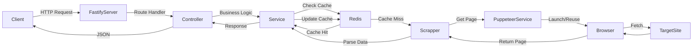
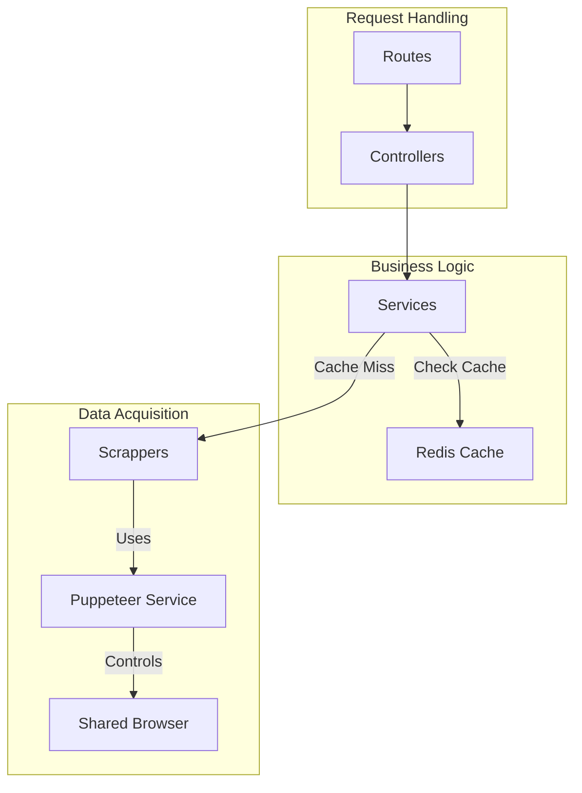

# Project Documentation Draft

> **Executive Summary**
> "Novel Backend" is a scalable scraping service designed to normalize inconsistent web novel data into a clean API. By leveraging Fastify, Puppeteer, and Redis, it achieves sub-second response times for cached requests while maintaining resilience against DOM changes and anti-bot mechanisms.


## Project Goals & Vision

**Goal:** Create a high-performance, scalable backend service for scraping and serving web novel content.
**Vision:** Provide a unified API to access novel data (chapters, details, search results) from various sources (currently "Novlove"), abstracting away the complexities of scraping, anti-bot mechanisms, and caching.
**Problem Solved:** Normalizes data from inconsistent HTML structures into a clean JSON API, handling performance bottlenecks like browser instantiation and network latency through efficient resource management and caching.

## Tech Stack & Dependencies

### **Core Runtime & Language**

- **Node.js**: The runtime environment, chosen for its non-blocking I/O, which is ideal for handling multiple concurrent scraping requests.
- **TypeScript**: Ensures type safety and better developer experience, especially critical when dealing with complex scraped data structures.

### **Frameworks & Libraries**

- **Fastify**: A high-performance web framework.
  - *Why:* Lower overhead than Express, built-in schema validation (though not heavily used here yet), and an excellent plugin system (`fastify-plugin`).
- **Puppeteer**: Headless Chrome Node.js API.
  - *Why:* The standard for scraping dynamic content that requires JavaScript execution.
- **@fastify/redis**: Fastify plugin for Redis.
  - *Why:* Seamless integration with Fastify for high-speed caching of scraped results.
- **Cheerio / HTML Parsers (Implicit in Scrappers)**: (Note: While Puppeteer is used, often Cheerio is used alongside for lighter parsing if the page is already loaded, or Puppeteer's own evaluation context is used).

### **Tooling**

- **esbuild**: Extremely fast JavaScript bundler. Used for creating production bundles.
- **ESLint + Prettier**: For code quality and consistent formatting.
- **tsx**: For running TypeScript directly in development (faster than `ts-node`).

## Developer Experience Notes

### **Getting Started**

1. **Install dependencies:**

    ```bash
    npm install
    # or
    pnpm install
    ```

2. **Start Redis (optional for local dev if mocked, but likely required):**

    ```bash
    docker compose up -d
    ```

3. **Run Development Server:**

    ```bash
    npm run dev
    ```

    The server will start on port 3000 (default).

### **Environment Variables**

Copy `.env.example` to `.env`:

```env
PORT=3000
HOST=127.0.0.1
REDIS_URL=redis://localhost:6379 
PUPPETEER_EXECUTABLE_PATH=/usr/bin/google-chrome-stable # Optional, helpful for varied OS
```

## Performance Considerations

### **Resource Blocking**

To drastically improve scraping speed and reduce bandwidth, the `PuppeteerService` is configured to block heavy resource types that aren't needed for extracting text content.

- **Blocked Types:** `image`, `media`.
- **Impact:** Reduces page load time from ~2-5s to <1s for many novel sites and saves significant memory per page.

### **Concurrency & Resource Management**

- **No Explicit Page Limit (CURRENTLY):** The code relies on the asynchronous nature of Fastify and Node to handle concurrent requests.
- **Shared Browser:** A single browser instance serves all requests, which is crucial. Creating a new browser per request would cap throughput at ~5-10 requests/min on standard hardware; the shared approach allows handling dozens of concurrent pages, limited primarily by CPU (parsing) and RAM (open tabs).

## Testing Strategy

### **Current Status**

Currently, the project relies on manual verification and TypeScript's static analysis.

### **Recommended Philosophy (To Be Implemented)**

1. **Unit Tests (Target: ~80% Coverage for Scrappers):**
   - **Goal:** Verify parsing logic is robust against edge cases (missing chapters, weird formatting).
   - **Approach:** Capture HTML snapshots from the target site and save them as fixtures (`.html` files). Run the scrapper functions against these local files to verify parsing logic without hitting the live site. usage: `vitest`

2. **Integration Tests:**
   - **Goal:** Verify the `NovelService` correctly orchestrates between Redis and the Scrapper.
   - **Key Scenarios:** 
     - Cache MISS -> Fetch -> Store -> Return keys.
     - Cache HIT -> Return keys without fetch.
   - Use a real Redis instance (via Docker) for these tests.

3. **E2E Tests:**
   - **Goal:** Validate API contract stability.
   - **Approach:** Spin up the full Fastify server and making HTTP requests to `localhost`. Verify the JSON structure of the response matches the expected schema.


## Resilience & Observability

### **DOM Change Detection**

- **Current:** Basic error handling in `PuppeteerService`. If a selector isn't found, it throws or retries.
- **Recommended:** Implement schema validation (e.g., using **Zod**) on the *output* of the scrapper. If the scraped object doesn't match the expected schema (e.g., missing "chapter content"), fail fast and alert. This distinguishes between "site down" and "site changed layout".
- **Fallback:** `redisCache` implementation includes a fallback mechanism: if Redis fails, it logs a warning but proceeds to fetch fresh data, ensuring the API remains available even if the cache layer is down.

### **Logging & Metrics**

- **Fastify Logger:** Used extensively for request/response logging and error reporting.
- **Puppeteer Debugging:**
  - Custom utility `saveDebugArtifacts` captures screenshots and HTML when scraping fails. This is critical for observability in a headless environment.
  - *Future Metrics (Prometheus/Grafana):*
    - **Browser Memory Usage:** Track shared browser RAM to detect leaks.
    - **Cache Hit Ratio:** Monitor Redis efficiency.
    - **Scrape Latency:** Average time per domain to detect target site slowness.
    - **Scrape Failure Rate:** 4xx/5xx errors per domain.


## Configuration & Tooling

- **Docker**: The project includes a `Dockerfile` for containerization, ensuring the scraping environment (dependencies, browser binaries) is consistent across deployments.
- **Environment Variables**: Managed via `.env` (using `dotenv`). Key variables likely include `PORT`, `HOST`, and Redis connection strings.
- **TypeScript Configuration**: Configured in `tsconfig.json` with `NodeNext` module resolution, ensuring compatibility with modern Node.js ESM standards. Paths aliases (`#scrapper/*`, `#utils/*`) are configured for cleaner imports.

## Architecture & Folder Structure

### **High-Level Architecture**



### **Folder Structure**

- `src/index.ts`: Application entry point. Registers plugins and starts the server.
- `src/config/`: Configuration plugins (Redis, CORS).
- `src/controllers/`: Handles incoming HTTP requests, extracts parameters, and calls services. Separation of concerns: Controllers don't know *how* data is fetched, only *what* to fetch.
- `src/services/`: Core business logic.
  - `novel.service.ts`: Orchestrates fetching from cache or scrapper.
  - `puppeteer/`: Manages the browser instance.
  - `scrapper/`: (Expected) Contains site-specific parsing logic.
- `src/routes/`: Defines API endpoints and maps them to controllers.
- `src/utils/`: Helper functions (e.g., `redisCache` wrapper, debug tools).

### **Code Flow & Dependency Graph**



## Key Engineering Decisions

### **Shared Browser Instance**

Instead of launching a new browser for every request (which is resource-heavy and slow), the `PuppeteerService` maintains a shared browser instance.

- *Benefit:* Significantly reduces latency and CPU/Memory usage.
- *Trade-off:* Requires careful management to ensure the browser doesn't crash or leak memory over time (handled via lifecycle hooks).

### **Repository/Service Pattern for Scraping**

The scraping logic is abstracted behind a Service layer (`NovelService`). The Controller doesn't know if data came from Redis or Puppeteer.

- *Benefit:* Makes it easy to swap scraping strategies or add new data sources without changing the API interface.

### **Aggressive Caching Strategy**

Redis is used to cache Home and Detail pages.

- *Performance:* Reduces load on the target site and speeds up response times for frequently accessed data.
- *Logic:* Pagination > 1 is explicitly skipped for caching in some lists to save granular storage, while high-traffic pages (Home) are cached.

## Interesting Code Snippets

### **1. Robust Puppeteer Page Retrieval with Debugging**

`src/services/puppeteer/puppeteer.ts`
This snippet demonstrates a production-grade approach to browser automation. It includes:

- **Automatic Retries:** If a page load fails, it retries once.
- **Debug Artifacts:** On failure, it saves a snapshot (HTML/Screenshot) to disk (`saveDebugArtifacts`), which is invaluable for debugging "it works on my machine" issues.
- **Resource Blocking:** It blocks images and fonts (if configured) to speed up scraping.

```typescript
// Inside getPage method
try {
  await page.goto(url, { waitUntil: PUPPETEER_CONFIG.waitOption });
  await waitSelectors();
  return page;
} catch (err) {
  // Captures state for debugging before retrying
  const snap1 = await saveDebugArtifacts(
    page,
    'goto-or-selectors-failed',
    fastify.log.error.bind(fastify.log),
  );
  // ... retry logic ...
}
```

### **2. Composable Caching Wrapper**

`src/services/novel.service.ts`
The `redisCache` utility abstracts the "Check Cache -> if Miss, Fetch & Set -> Return" pattern. This makes the service methods clean and readable.

```typescript
const getHome = async () => {
    return redisCache(fastify, {
        key: NOVLOVE_CONFIG.home.redis_key,
        ttl: NOVLOVE_CONFIG.home.ttl_seconds,
        fetcher: () => homeScrapper(fastify), // Only executed on cache miss
    });
};
```

## Security Considerations

- **Ethical Scraping:**
  - **Rate Limiting:** Currently implicit via natural processing time. To scale safely, an explicit rate limiter (e.g., `bullmq` job queue) should be added to throttle requests to the *same domain* (e.g., max 1 request per second per target host).
  - **User Agent:** Uses a standard User-Agent string to mimic a real browser, but respects `robots.txt` (manual verification required as Puppeteer ignores valid robots.txt by default).
- **Secrets Management:**
  - Sensitive data (Redis URL) is strictly managed via `.env` files and never committed to version control.
  - `dotenv` is used to load these at runtime.
- **Hardening Notes (Future):**
  - **Throttling Middleware:** Implement `@fastify/rate-limit` to prevent Abuse of our own API.
  - **Log Sanitization:** Ensure error logs strip out raw HTML or sensitive headers before writing to stdout/files.


## Future Improvements / Lessons Learned

- **Rate Limiting**: Currently, there's no explicit rate limiting on the *outgoing* requests to the target site. Adding a queue (e.g., `bullmq`) could prevent getting IP-banned by the target.
- **Error Handling**: If the target site changes its DOM structure, the scrappers will fail. Implementing a more resilient parsing strategy (e.g., using LLMs for fallback parsing or schema validation on scraped data) would improve reliability.
- **Monitoring**: Puppeteer exploits are resource-intensive. Adding Prometheus metrics for browser memory usage and open pages would be a good next step for observability.
