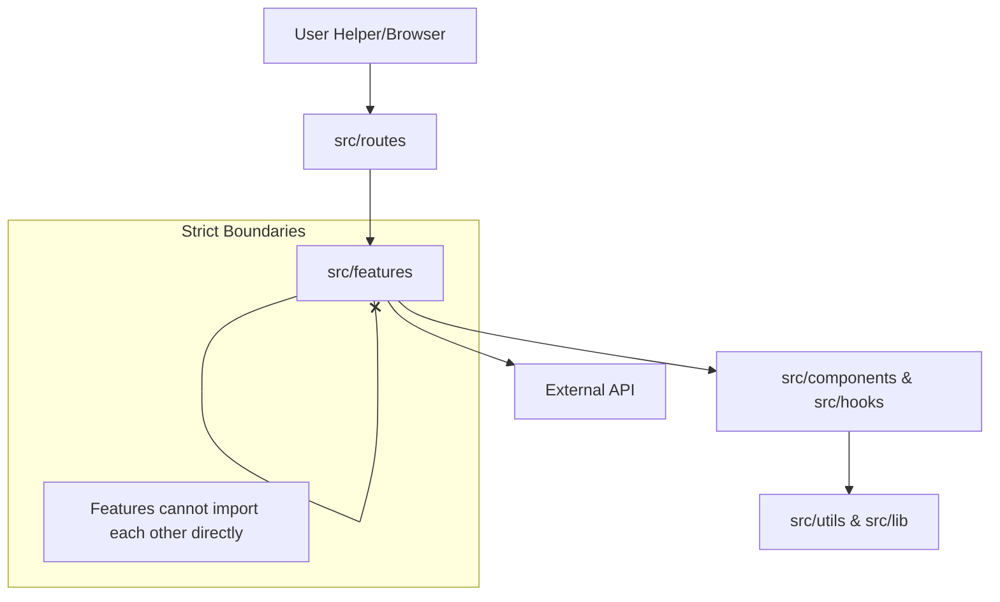

# Project Documentation: Novel Client

## 1. Project Goals & Vision

**Novel Client** is a lightweight, distraction-free web interface for reading novels. It serves as the frontend counterpart to a separate novel scraping backend.

**Key Goals:**

- **Distraction-Free Reading**: A clean UI focusing solely on the text, with customizable themes (Light, Dark, Sepia).
- **Offline Capabilities**: Built-in support for caching recent chapters for offline reading (via IndexedDB/localForage).
- **Performance**: Fast load times and smooth transitions using a modern SPA architecture.
- **Maintainability**: A strictly modular codebase designed to scale without becoming "spaghetti code."

**Target Users:**

- Avid web novel readers who want a consolidated, pleasant reading experience without ads or clutter.

## 2. Tech Stack & Dependencies

The project leverages a modern React ecosystem optimized for performance and type safety.

- **Core Framework**: [React 19](https://react.dev/) + [Vite](https://vitejs.dev/) (Fast development and optimal production builds).
- **Language**: [TypeScript](https://www.typescriptlang.org/) (Strict type safety).
- **Routing**: [@tanstack/react-router](https://tanstack.com/router) (Type-safe routing with search param validation).
- **Data Fetching**: [@tanstack/react-query](https://tanstack.com/query) (Server state management, caching, and background updates).
- **Styling**: [@emotion/styled](https://emotion.sh/) (CSS-in-JS for component-scoped dynamic styling).
- **Validation**: [Zod](https://zod.dev/) (Schema validation for API responses and routerParams).
- **Testing**: [Vitest](https://vitest.dev/) + [Testing Library](https://testing-library.com/) (Fast unit and component testing).
- **Icons**: [Lucide React](https://lucide.dev/).

**Why this stack?**

- **TanStack Router** was chosen over React Router for its superior type safety and built-in search parameter handling, which is crucial for a reading app (e.g., preserving reading settings in URL).
- **Emotion** allows for easy theming implementation, which is a core feature (changing background/text colors dynamically).

## 3. Developer Experience & Setup

The project is designed for a frictionless developer onboarding experience.

### **Getting Started**

1. **Clone & Install**:

    ```bash
    git clone <repo-url>
    cd novel_client
    npm install
    ```

2. **Environment Variables**:
    Copy `.env.example` to `.env` (if present) or strictly check `vite.config.ts`. The primary variable is:
    - `BASE_API_URL`: Points to the scraping backend.
3. **Run Locally**:

    ```bash
    npm run dev
    ```

    The server typically starts at `http://localhost:5173`.

### **Gotchas**

- **Proxy**: The Vite dev server proxies `/api` requests to `BASE_API_URL`. Ensure your backend is running if you want real data, otherwise, you may see network errors.
- **Router**: TanStack Router uses file-based routing in `src/routes`. Do not declare routes manually; create files and let the plugin generate the tree.

## 4. Configuration & Tooling

- **Linting & Formatting**:
  - **ESLint**: Uses `eslint.config.js` (flat config).
  - **Plugins**: Includes `eslint-plugin-boundaries` to strictly enforce architectural layers (e.g., features cannot import from other features directly without public API).
  - **Prettier**: integrated for consistent code formatting.
- **Vite Configuration**:
  - Configured with `@tanstack/router-plugin` for auto-generated route trees.
  - Proxy settings (`/api`) configured to forward requests to `env.BASE_API_URL`.
- **CI/CD**:
  - Local `npm run test` and `npm run lint` scripts ensure code quality before commits.

## 5. Architecture & Folder Structure

The project follows a **Feature-Based Architecture** with enforced boundaries.

### **High-Level Diagram**



### **Folder Structure**

```text
src/
├── app/              # App-wide setup (providers, global styles)
├── components/       # Shared UI components (Button, Input, Logo)
├── features/         # Domain-specific logic
│   ├── detail/       # Novel details feature
│   │   ├── api/      # Feature-specific API calls
│   │   ├── components/ # Feature-specific components
│   │   ├── hooks/    # Feature-specific hooks
│   │   └── index.tsx # Public API for the feature
│   ├── list/         # Novel listing feature
│   └── reader/       # Reading interface feature
├── hooks/            # Global hooks (useThemeContext)
├── lib/              # Shared libraries and utilities (axios, test mocks)
├── routes/           # TanStack Router file-based routes
└── utils/            # Pure utility functions
```

### **Rationale**

- **Modularity**: Each feature in `src/features/` is self-contained. `eslint-plugin-boundaries` prevents cross-feature coupling (e.g., `detail` cannot import deep into `list`).
- **Scalability**: New features can be added without modifying existing code.
- **Routes Separation**: Routes (`src/routes`) delegate the UI rendering to feature components, ensuring the routing layer remains thin.

## 6. Performance & Caching Strategy

- **Code Splitting**: TanStack Router's `autoCodeSplitting: true` ensures that each route is bundled lazily. Users only download the JavaScript required for the page they are viewing.
- **Data Caching**: TanStack Query (React Query) aggressively caches API responses.
  - **Stale-While-Revalidate**: Users see cached content instantly while the app fetches fresh data in the background.
  - `staleTime`: Configured to reduce unnecessary network requests for static novel content.
- **Offline Storage**:
  - **localForage/IndexedDB**: Used to persist "Recently Read" novels and specific chapter content. This allows users to read previously opened chapters without an internet connection.

## 7. Testing Philosophy

We advocate for the **Test Pyramid**, aiming for high confidence with fast feedback.

- **Unit Tests (`vitest`)**:
  - Target: Utility functions, hooks, and complex logic within features.
  - Goal: Ensure isolated logic works correctly.
- **Component Tests (`@testing-library/react`)**:
  - Target: Shared UI components and Feature components.
  - Goal: Verify accessible interactivity (e.g., "clicking Next Chapter actually calls the function").
- **Mocking Strategy**: We use a **Mock Factory Pattern** (see code snippet below) to avoid hoisting issues and ensure consistent router/API mocks across all test files.

## 8. User Experience & Design Decisions

- **Theming**:
  - **Why multiple themes?** Reading white-on-black (Dark Mode) reduces eye strain at night, while Sepia mimics physical paper. This is critical for long-form reading apps.
  - Implementation: Global keys in emotion `ThemeProvider` allow hot-swapping entire color palettes instantly.
- **Accessibility (a11y)**:
  - **Semantic HTML**: Proper `<article>`, `<main>`, and `<nav>` tags are used.
  - **Font Scaling**: The Reader UI supports user-defined font sizes, which persists in local storage.
  - **Keyboard Navigation**: Interactive elements (chapter navigation) are tab-accessible.

## 9. Key Engineering Decisions

- **Strict Architectural Boundaries**:
  - **Decision**: Use `eslint-plugin-boundaries`.
  - **Reason**: To prevent circular dependencies and tight coupling common in React apps. A feature can only import from "shared" layers (`components`, `hooks`, `lib`) or its own internals. Inter-feature communication must go through defined public exports.

- **Mock Factory Pattern for Tests**:
  - **Decision**: Create shared mock factories (e.g., `routerMock`) instead of per-file mocks.
  - **Reason**: `vi.mock` hoisting often leads to `ReferenceError` if dependencies are not handled carefully. The factory pattern ensures mocks are initialized correctly and reused consistently across `Error.test.tsx`, `Header.test.tsx`, etc.

- **Component Library vs. Feature Components**:
  - **Decision**: Generic UI (Buttons, Logos) lives in `src/components`. Business-logic-heavy UI lives in `src/features/*/components`.
  - **Reason**: keeps the shared component library pure and reusable.

## 10. Interesting Code Snippets

### **1. Architectural Enforcement (ESLint)**

This configuration ensures that `features` stay isolated and specialized layers like `routes` don't leak logic.

```javascript
// eslint.config.js partial
{
  'boundaries/element-types': [
    'error',
    {
      default: 'disallow',
      rules: [
        { from: ['feature'], allow: ['shared', ['feature', { featureName: '${from.featureName}' }]] }, // Features can only touch themselves or shared
        { from: ['app'], allow: ['app', 'feature', 'shared'] }, // App orchestrates everything
      ]
    }
  ]
}
```

### **2. Reusable Router Mock Factory**

A robust way to mock third-party libraries globally for Vitest, solving hoisting issues.

```typescript
// src/lib/test/mock/router.tsx
export const routerMock = async (importOriginal: <T>() => Promise<T>) => {
  const actual = await importOriginal<typeof import('@tanstack/react-router')>();

  // Custom mock implementation for Link
  const MockLink = ({ children, to, ...props }: any) => (
    <a href={to} {...props}>{children}</a>
  );

  return {
    ...actual,
    Link: MockLink,
    useMatchRoute: () => () => false, // Default stub
  };
};

// Usage in tests
vi.mock('@tanstack/react-router', async (importOriginal) => {
  const { routerMock } = await import('lib/test/mock/router');
  return routerMock(importOriginal);
});
```

## 11. Future Improvements

1. **E2E Testing**: Implement Playwright to test the full reading flow (e.g., navigating from list -> detail -> read).
2. **Storybook**: Add Storybook to document and visualize the shared UI components in `src/components`.
3. **Virtualization**: For very long novel lists, implement `tanstack-virtual` to improve rendering performance.
4. **PWA Support**: Enhance the `vite-plugin-pwa` configuration (if present) to fully support "Add to Home Screen" and offline reading for mobile users.
